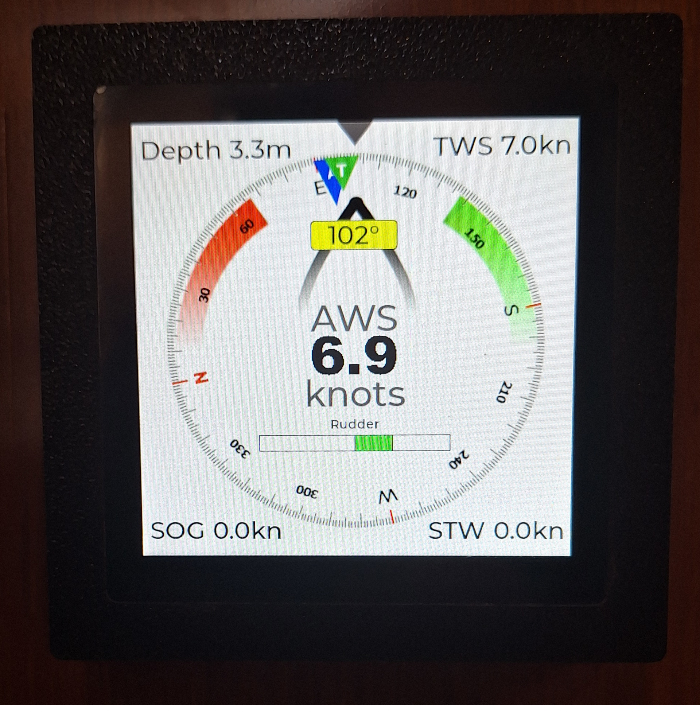
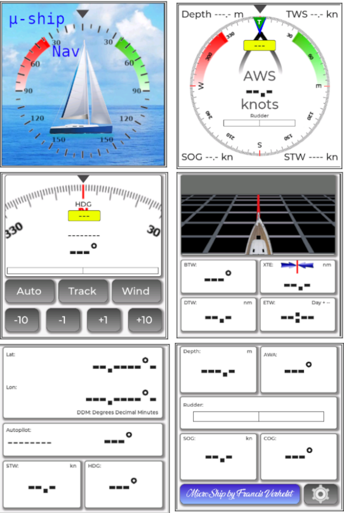
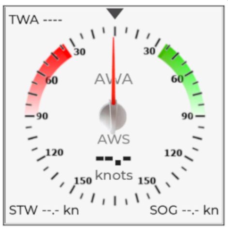
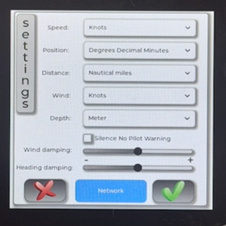
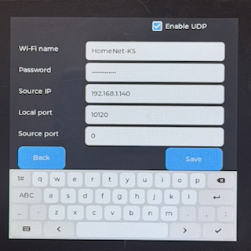
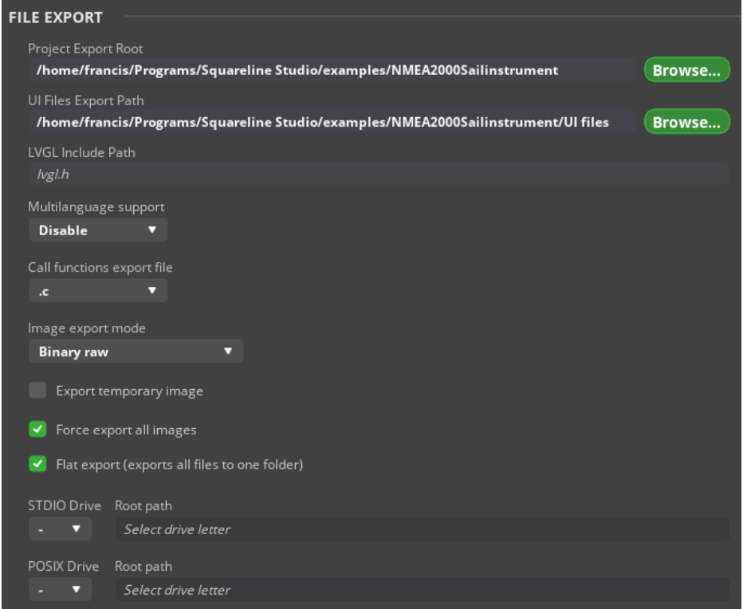
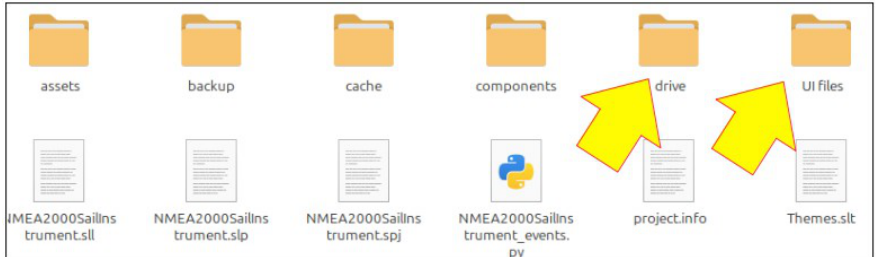
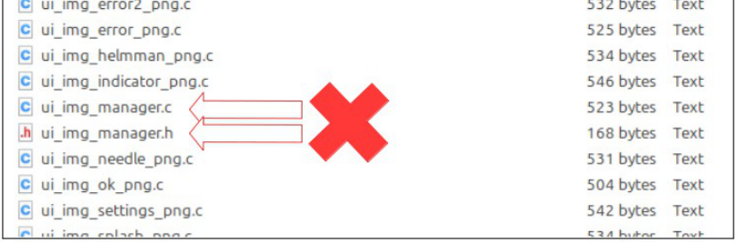
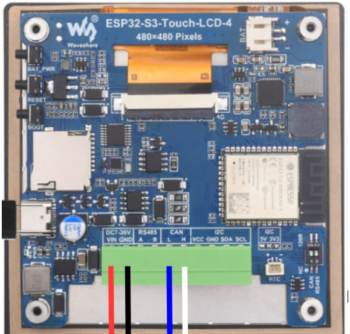

# ESP32-S3 NMEA2000 Display with Autopilot, Alarms and Actisense UDP over Wi-Fi

<p>
  
</p>

Based on the original **francissailor** project and on work by Homberger and Timo Lappalainen.

## Information About This Version

This project is based on the original **francissailor** project. Thank you to francissailor for creating and sharing it. The **Actisense BIN over UDP** stream reception functionality was added to the original project, allowing NMEA2000 data to be received over Wi-Fi as well.

The original project was adapted to compile and upload in the **PlatformIO** environment. Simply compile the project, upload the firmware, and upload the FFAT filesystem image using PlatformIO.

The UDP stream is enabled on the dedicated configuration page on the display: **Settings > Network**. The UDP connection is receive-only at present. It can receive NMEA2000 data, but it cannot be used to control the autopilot.

A DIY NMEA2000 display for the Waveshare ESP32-S3-Touch-LCD-4, with autopilot support, alarm handling, and a touchscreen user interface designed as an affordable replacement for older marine displays such as the Raymarine ST70.

> **☕ If this project helps you, please support the original author, `francissailor`, by buying him a coffee:** [Buy Me a Coffee](https://buymeacoffee.com/francissailor)  
> Even a small contribution helps him keep improving the project. The funding is being used to develop a watertight, sunlight-readable screen for outdoor and cockpit use.

## What to Expect

- A fully working NMEA2000 display comparable to some commercial displays
- No soldering required: just connect the NMEA2000 wires and the power wires to the terminal block
- A 3D-printable housing with the same mounting-hole pattern as an ST70 instrument
- Compatibility with Raymarine Evolution autopilot modes
- Display and acknowledgement of autopilot-related alarms
- Configurable units (knots, km/h, m/s, ft, m, and more) through a settings screen
- Settings stored in flash memory

## What Not to Expect

- The display is **not bright enough for comfortable outdoor use** in full sun (about 350 nits)
- The display is **not ruggedized** for outdoor use
- The housing is **not watertight** and is not designed for outdoor exposure

Hopefully, Waveshare will eventually offer a higher-brightness version of this board. If that would also help your use case, please consider asking them for a high-nit version of the **ESP32-S3-Touch-LCD-4** through their support page on the Waveshare wiki.

## Hardware Required

- **Waveshare ESP32-S3-Touch-LCD-4, Version 4**
- An **NMEA2000 cable** compatible with your boat network  

## Screenshots

<p>
  
</p>

<p>
  
  
  
</p>

*These are screenshots, so they are not animated and do not show live NMEA2000 values.*

## Hardware

The project uses the **Waveshare ESP32-S3-Touch-LCD-4** board, which includes:

- Integrated CAN bus
- Supply voltage up to 37 V
- A 480 × 480 LCD touchscreen

The board costs about **€35**, and no soldering is required.

**Important:** there are different versions of this board. Make sure the one you buy has the **integrated CAN bus** and is version 4.

The board is delivered without a housing, so the original project includes a housing designed in **FreeCAD**.

## Software Development

The project is built and uploaded with **PlatformIO**.
The user interface was designed with **SquareLine Studio**.
The NMEA2000 stack is based on the work of **Timo Lappalainen**:

- [Timo Lappalainen on GitHub](https://github.com/ttlappalainen)

## Software Notes

This software uses the ESP32-S3 quite heavily:

- The **NMEA2000 library and decoding logic** run in a FreeRTOS task on **core 0**
- Using core 0 was necessary because the NMEA2000 network can be busy at high data rates
- With a single large sketch running on core 1, the system was missing some NMEA2000 messages
- The user interface stores graphical assets in a **FFAT partition**
- At startup, those assets are copied into **PSRAM**
- The normal flash partition for the sketch is too small for all graphics
- PSRAM is much faster than reading graphical assets directly from flash, which improves screen refresh performance

The graphical assets are uploaded separately as an FFAT filesystem image, and PlatformIO handles this directly.

There is also a small auxiliary FreeRTOS task for the onboard beeper. When the beeper routine was integrated directly into the UI sketch using `millis()`, the beeps became irregular because of the screen update load.

### Important for people modifying the code

The LCD on this Waveshare board uses an **RGB interface**, so LCD timing is critical. The timing values in `lvgl_port_v8.h` have been carefully fine-tuned. Changing those settings can corrupt the display.

Please also pay close attention to the library versions recommended on the Waveshare wiki:

- [Waveshare ESP32-S3-Touch-LCD-4 Wiki](https://www.waveshare.com/wiki/ESP32-S3-Touch-LCD-4)

This also affects which version of **SquareLine Studio** you can use, because recent versions dropped support for **LVGL 8.4**.

**Modifying this project is not for beginners.**

## Board Modification

Some boards may require a hardware modification to start automatically when powered from the NMEA2000 network. This modification is not required if your board starts normally, and it should not be carried out unless you have this specific problem.

For the complete explanation of the modification, wiring details, and the required software changes, please refer to the documentation in the original project:

[Original NMEA2000-DISPLAY-on-ESP32S3 project](https://github.com/yetimilas/NMEA2000-DISPLAY-on-ESP32S3)

## Build from Source

The source files and libraries are included in their respective folders.

### 1. Load assets into FFAT with PlatformIO

The project is configured to create and upload the FFAT image directly with PlatformIO. The graphical assets are stored in:

```text
data/assets/
```

This directory already contains the required `.bin` files from the **`Squareline Studio/drive/assets`** folder. Do not copy the original `.png` files; the firmware expects the generated `.bin` files.

Upload the firmware and the filesystem image from the project directory:

```bash
pio run --target upload
pio run --target uploadfs
```

The first command uploads the firmware and partition table. The second command creates an FFAT image from `data/` and uploads it to the `ffat` partition. The files will be stored on the board as `/ffat/assets/*.bin`.

The UDP Actisense connection can be configured on the dedicated **Settings > Network** screen. The screen stores the Wi-Fi name, password, source IP, local port, source port, and UDP enable state in flash memory. Use source port `0` to accept any UDP source port. Press **Save** to store the settings and restart the device. The UDP stream is receive-only and cannot currently control the autopilot.

## SquareLine Studio Project

The full SquareLine Studio project is included in the **`Squareline Studio`** folder.

If you want to modify it, keep these rules in mind:

- Use **SquareLine Studio 1.5.4**
- Newer versions no longer support **LVGL 8.4**
- This Waveshare board works with **LVGL up to 8.4**
- Later LVGL versions will not work correctly with this board

### SquareLine Studio export settings

Use the following export settings:

<p>
  
</p>

When SquareLine Studio exports the UI, two folders are important:

- the **drive** folder
- the **UI files** folder

<p>
  
</p>

### Important file copy rule

Copy all files from the **`UI files`** folder into the project's source folders **except**:

- `ui_img_manager.c`
- `ui_img_manager.h`

Those two files are already present in the project in modified form so they can work with PSRAM.

<p>
  
</p>

If you add or replace assets, the new assets will be in the **drive** folder. You must upload them again to the FFAT partition as described above. Run `pio run --target uploadfs` to recreate and upload the FFAT image with the updated assets.

## Housing

The housing files are included in the **`Freecad`** folder. The housing was designed for this display and includes files for direct 3D printing.

For complete information about the housing, FreeCAD compatibility, mounting, and assembly, please refer to the documentation in the original project:

[Original NMEA2000-DISPLAY-on-ESP32S3 project](https://github.com/yetimilas/NMEA2000-DISPLAY-on-ESP32S3)

Take particular care when mounting the display. Tightening the **2.5 mm screws** too much can crack the LCD glass. Gluing the display in place may be safer.

## Hardware Connections

Use an NMEA2000 cable and cut it to the desired length.

For **Raymarine Seatalk NG**, the wire colors are:

- **Red** → `Vin`
- **Black** → `GND`
- **White** → `CAN H`
- **Blue** → `CAN L`

<p>
  
</p>

## Contact

This is an adapted version of the original project. For questions, support, and the latest information, please visit the original repository:

[NMEA2000-DISPLAY-on-ESP32S3](https://github.com/yetimilas/NMEA2000-DISPLAY-on-ESP32S3)

---

> **☕ If you found this project useful, please support the original author, `francissailor`, by buying him a coffee:** [Buy Me a Coffee](https://buymeacoffee.com/francissailor)
